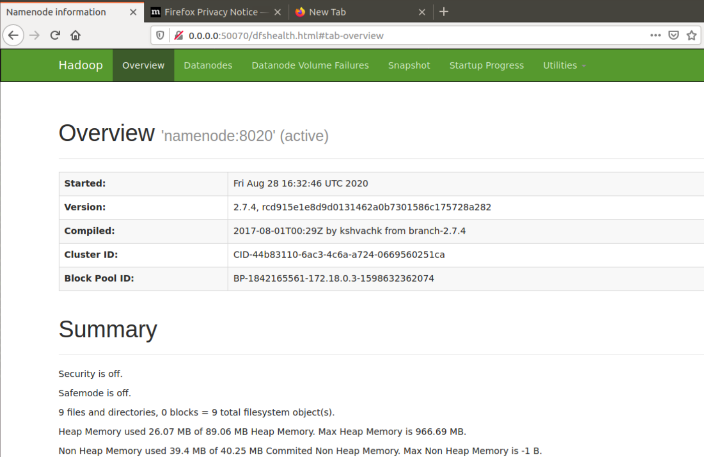
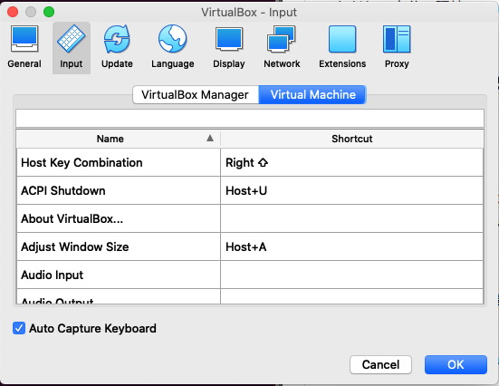

# Hive（Hadoop）ハンズオン


## 1. Linux上でのdockerのセットアップ

docker composeとdockerはapt-get等でインストールする必要がある。

```bash
sudo apt-get install -y apt-transport-https ca-certificates curl software-properties-common
curl -fsSL https://download.docker.com/linux/ubuntu/gpg | sudo apt-key add -
sudo add-apt-repository \
   "deb [arch=amd64] https://download.docker.com/linux/ubuntu \
   $(lsb_release -cs) \
   stable"
sudo apt-get update
sudo apt-get install -y docker-ce docker-compose
```


参考記事：https://qiita.com/tkyonezu/items/0f6da57eb2d823d2611d


## 1. (補足) Macのdockerでhiveを動かしたい人

以下の記事が参考になる。

- https://github.com/prasanthj/docker-hive-on-tez

ただし、自分の環境(High Sierra)だとboot2dockerがイントールできなかった。特に拘りがなければ、Linuxにインストールするのが手っ取り早い。

# 2. Docker Hive　ハンズオン

## 2.1 注意点

正規のGitHubリポジトリ（https://github.com/big-data-europe/docker-hive）からDockerfile等をcloneして、docker composeで環境を構築する必要がある。Docker Hubで単体でdocker pullするのみの場合、モジュール不足で動作しない。

## 2.2 JREのインストール（スキップ）

javaファイルを実行する場合は、JRE（もしくはJDK）が入っていない方はインストールをすると良いです。今回は使用しません。

参考記事：[OpenJDK（Java）を最新のUbuntuにインストール](https://qiita.com/terappy/items/537c069923144a9d9755)

```bash
sudo apt install openjdk-11-jre
```


## 2.3 dockerの起動

参考：[docker-hive (GitHub)](https://github.com/big-data-europe/docker-hive)

※リポジトリは任意の場所に保存していただいて大丈夫です。

```bash
cd ~
git clone https://github.com/big-data-europe/docker-hive/
cd docker-hive
sudo docker-compose up -d
```


## 2.4 動作確認 namenodeのポートにブラウザからアクセス。

今回はnamenodeの名前が付くコンテナの開放されているポート（私の環境だと0.0.0.0:50070）にアクセスした。すると、このような画面が現れる。


Apache Software Foundation. (2010). Hadoop. Retrieved from https://hadoop.apache.org

コンテナとポートの確認方法は、

```bash
sudo docker ps
```

でできる。こちらを実行すると、私の環境ではこのようになった。

```bash
CONTAINER ID   IMAGE                                             COMMAND                  CREATED          STATUS                    PORTS                                                             NAMES
b2e65f8b8ece   bde2020/hive:2.3.2-postgresql-metastore           "entrypoint.sh /bin/…"   44 minutes ago   Up 44 minutes             0.0.0.0:10000->10000/tcp, :::10000->10000/tcp, 10002/tcp          docker-hive_hive-server_1
5457a1dcb493   bde2020/hadoop-datanode:2.0.0-hadoop2.7.4-java8   "/entrypoint.sh /run…"   44 minutes ago   Up 43 minutes (healthy)   0.0.0.0:50075->50075/tcp, :::50075->50075/tcp                     docker-hive_datanode_1
55f4eccd9abc   bde2020/hadoop-namenode:2.0.0-hadoop2.7.4-java8   "/entrypoint.sh /run…"   44 minutes ago   Up 44 minutes (healthy)   0.0.0.0:50070->50070/tcp, :::50070->50070/tcp                     docker-hive_namenode_1
bb2b0c31ea65   shawnzhu/prestodb:0.181                           "./bin/launcher run"     44 minutes ago   Up 43 minutes             0.0.0.0:8080->8080/tcp, :::8080->8080/tcp                         docker-hive_presto-coordinator_1
1942f54afb04   bde2020/hive-metastore-postgresql:2.3.0           "/docker-entrypoint.…"   44 minutes ago   Up 44 minutes             5432/tcp                                                          docker-hive_hive-metastore-postgresql_1
0daa712c01b9   bde2020/hive:2.3.2-postgresql-metastore           "entrypoint.sh /opt/…"   44 minutes ago   Up 44 minutes             10000/tcp, 0.0.0.0:9083->9083/tcp, :::9083->9083/tcp, 10002/tcp   docker-hive_hive-metastore_1

```


## 2.5 動作確認2（任意）

```bash
# （不要な場合もあるが念の為紹介）
docker-compose exec hive-server bash

# jdbcのシェルにログイン　動作確認をする
/opt/hive/bin/beeline -u jdbc:hive2://localhost:10000
# jdbcのインタラクティブなテーブル操作が開始
  > CREATE TABLE pokes (foo INT, bar STRING);
  > LOAD DATA LOCAL INPATH '/opt/hive/examples/files/kv1.txt' OVERWRITE INTO TABLE pokes;
```


## 2.6 動作確認3（任意）

これを題材にして取り組んでみる。

- https://www.atmarkit.co.jp/ait/articles/1701/01/news022.html

```bash
/opt/hive/bin/beeline -u jdbc:hive2://localhost:10000
# Hiveにデータをロードする。
source ./products_tutorial.hql;
```


データをロードしたら、今回はPrestoから実行する。(MapReduceは上記のjdbc:hive2://localhost:10000では動かないかも？)

hiveのバイナリファイル本体はコンテナの中の```/opt/hive/bin```にある。

## 2.7 実際にデータを集計してみる

### 2.7.1 コロナ下におけるニュージーランドの貿易に関するデータセットをダウンロードしてみる。

引用元：「CSV files for download | Stats NZ」（https://www.stats.govt.nz/large-datasets/csv-files-for-download/）

```bash
curl https://www.stats.govt.nz/assets/Uploads/Effects-of-COVID-19-on-trade/Effects-of-COVID-19-on-trade-1-February-19-August-2020-provisional/Download-data/Effects-of-COVID-19-on-trade-1-February-19-August-2020-provisional.csv > trade.csv
```

### 2.7.2 hadoopとhiveのPATHを通す

hadoopやhiveのバイナリが存在するコンテナのbashに接続する。

バイナリは私の環境では```bde2020/hive:2.3.2-postgresql-metastore```のコンテナに存在した。コンテナにはCONTAINER IDをコマンドに指定して接続すると簡単に接続できる。

```bash
# コマンドの例
sudo docker exec -it b2e444558ece bash
```
bashに接続できたら、バイナリファイルのPATHを通す。（なお、このPATHは対象のコンテナ内でしか有効にならないはず）

```bash
vim ~/.bashrc

# 以下を追記
export PATH="$PATH:/opt/hadoop-2.7.4/bin"
export PATH="$PATH:/opt/hive/bin"
```

### 2.7.3 hadoopのファイルシステムに集計対象のデータをコピー

```bash
# hadoopのPATHを通したので、直接hadoopコマンドが使える。
## hadoopの /trade-NZ ディレクトリにtrade.txtを保存する。(.csvで保存しても良い。)
hadoop fs -mkdir /trade-NZ
hadoop fs -put trade.csv /trade-NZ
## hadoopのファイルシステムの /trade-NZ ディレクトリに何が保存されているか見てみる。
hadoop fs -ls /trade-NZ
```

注意：jdbcとhadoopのfsコマンドは別物。jdbcにhadoopのコマンドを書いても動かない。

以下のコマンドをtrade_tutorial.hqlとして保存。最後の改行も含んで保存。このソースコードはテーブルを作成するために使用する。なお、インタラクティブなhive上のシェルに直接このソースコードを貼り付けて実行しても良い。

このコマンドは、hadoopファイルシステムに設置した/trade-NZディレクトリの中にあるテキストファイル全てのデータを、定義したスキーマのテーブル（trade_table）に登録していくことを目的としている。ファイルが複数あってもOK。

なおこのコマンドは、「,」で区切って読み込み、改行ごとに一つのデータを読み込み、csv形式のファイルの最初の一行目はデータの説明が書かれているので省く、といった処理を表ている。

```sql
CREATE EXTERNAL TABLE IF NOT EXISTS trade_table(
Direction STRING, Year INT, DateString STRING, Weekday STRING,
CurrentMatch STRING, Country STRING, Commodity STRING,
TransportMode STRING, Measure STRING, Value INT, Cumulative INT
)
ROW FORMAT DELIMITED FIELDS TERMINATED BY ','
LINES TERMINATED BY '\n'
STORED AS TEXTFILE
LOCATION '/trade-NZ'
TBLPROPERTIES ('skip.header.line.count'='1')
;

```

### 2.7.4 ここまでの参考文献

- https://docs.cloudera.com/HDPDocuments/HDP3/HDP-3.1.5/using-hiveql/content/hive_create_an_external_table.html

- https://riptutorial.com/ja/hive/example/11427/%E3%83%86%E3%83%BC%E3%83%96%E3%83%AB%E3%81%AE%E4%BD%9C%E6%88%90
- https://dwgeek.com/hive-create-external-tables-examples.html/

### 2.7.5 dockerの中から、hiveコマンドでインタラクティブシェルを起動し、sourceコマンドで実行してみる。

```bash
# コンテナの中のbashなどで
hive
```

```sql
# インタラクティブなHiveのシェルが起動。.hqlファイルを実行。
source trade_tutorial.hql;
```

### 2.7.6 実際に集計してみる

#### 2.7.6.1

csvデータの中身を直接見てみる。このデータは、**コロナの状況下におけるニュージーランドの貿易の取引高を記録したものとなっている。コロナの感染者数などのデータは含んでいない**。Valueはその日にあった取引高で、Cumulativeは去年の2月2日からその日までの取引高の合計。毎年2月2日に合計が0にリセットされる。

```csv
Direction,Year,Date,Weekday,Current_Match,Country,Commodity,Transport_Mode,Measure,Value,Cumulative
Exports,2015,31/01/2015,Saturday,1/02/2020,All,All,All,$,257000000,257000000
Exports,2015,1/02/2015,Sunday,2/02/2020,All,All,All,$,123000000,380000000
Exports,2015,2/02/2015,Monday,3/02/2020,All,All,All,$,176000000,556000000
Exports,2015,3/02/2015,Tuesday,4/02/2020,All,All,All,$,115000000,671000000
Exports,2015,4/02/2015,Wednesday,5/02/2020,All,All,All,$,74000000,746000000
Exports,2015,5/02/2015,Thursday,6/02/2020,All,All,All,$,119000000,864000000
Exports,2015,6/02/2015,Friday,7/02/2020,All,All,All,$,127000000,992000000
Exports,2015,7/02/2015,Saturday,8/02/2020,All,All,All,$,206000000,1198000000
Exports,2015,8/02/2015,Sunday,9/02/2020,All,All,All,$,114000000,1312000000
```
#### 2.7.6.2 HQLを実行してみる

HiveQLでテーブルのカラム名を表示してみる

HQL
```sql
desc trade_table;
```

実行結果
```bash
direction               string                                      
year                    int                                         
datestring              string                                      
weekday                 string                                      
currentmatch            string                                      
country                 string                                      
commodity               string                                      
transportmode           string                                      
measure                 string                                      
value                   int                                         
cumulative              int
```


---
その他のHiveQLの実行例（分散処理が実行されるほどテーブルにデータが無かったり、WITH句なども使用していないのであくまで参考までに）
```sql
SELECT 
  *
FROM 
  trade_table
LIMIT
  100
;
```
---

```sql
select
  from_unixtime(unix_timestamp(trade_table.datestring , 'yyyy-MM-dd'))
from
  trade_ver5
limit
  30
;
```

---

```sql
select inp_dt, from_unixtime(unix_timestamp(substr(inp_dt,0,11),'dd-MMM-yyyy')) as todateformat from table;
```

---

```sql
select
  from_unixtime(unix_timestamp('2018/08/21','yyyy/MM/dd'), 'yyyyMMdd') as time_adhoc
from
  trade_table
where
  time_adhoc between
  20180201 and 20190201
limit
  30
;
```

---

```sql
select
  datestring as converted_date,
  value
from
  trade_ver5
where
  from_unixtime(unix_timestamp(trade_ver5.datestring,'dd/MM/yyyy'), 'yyyyMMdd') between 20180201 and 20190201
;
```

---

```sql
select
  from_unixtime(unix_timestamp(trade_ver5.datestring,'dd/MM/yyyy'), 'yyyyMMdd'),
  value
from
  trade_ver5
where
  from_unixtime(unix_timestamp(trade_ver5.datestring,'dd/MM/yyyy'), 'yyyyMMdd') between 20190201 and 20190227
;
```
---

```sql
with add_date_column as (
select
  from_unixtime(unix_timestamp(covid_ver5.datestring,'dd/MM/yyyy'), 'yyyy-MM-dd'),
  value
from
  trade_table
limit
  30
)

select 
  *
from
  add_date_column
;
```

---

# 3. 補足

## 3.1 Hiveのコンテナの環境をcommitして保存した後に、再利用する方法

### 3.1.1 commitで環境の保存をする

```bde2020/hive:2.3.2-postgresql-metastore``` というコンテナ名の「CONTAINER ID（コンテナID）」を見つける

以下のコマンドでcommitする。その他のコンテナを保存したい時も同様に、bde2020の部分をhaim_container_ver1などのわかりやすいタグをつけて保存。（haim_container_ver1の部分は任意だが、今回の勉強会ではhaim_container_ver1を使うと良い。docker-composeファイルを修正する時に混乱しないような名前が良い）

```bash
docker commit コンテナID haim_container_ver1/hive:2.3.2-postgresql-metastore
```


### 3.1.2 コンテナの起動

コンテナ群を起動する際はrunコマンドで直接起動せず、docker-composeコマンドで起動すると確実。ポート番号の紐付けなどがされる。

```bash
# 良い例（docker-compose.ymlを用いて起動する）
sudo docker-compose up -d

# ダメな例（docker-composeを用いずに直接runしようとする）
# sudo docker run -it $(sudo docker images | grep "haim_container_ver1.*（runしたいイメージ名の一部分）" | awk '{print $3}')
```


### 3.1.3 hadoopとhiveのバイナリが存在するコンテナ

bde2020/hive:2.3.2-postgresql-metastoreのようなファイルに、hadoopやhiveのバイナリの実行可能ファイルが存在する。２回目以降で作業する場合はこのようなコマンドでシェルに潜れる。

```bash
# ワイルドカードで、hiveのバイナリがあるコンテナのシェルにログインする。
sudo docker exec -it $(sudo docker ps -a | grep 'haim.*hive:2.3.2-postgresql-metastore' | awk '{print $1}') bash
```

---

## 3.2 dockerでhadoopの動作確認をしてみる（チュートリアル）

### 3.2.1 チュートリアルをとりあえず実行

以下のチュートリアルに倣う。(docker-hadoopのデモであり、<b>docker-hiveのデモではないので注意。</b>)

コンテナのシェルに```docker exec```コマンドで接続して、次のステップの手順でコンテナ内で作業を行う。

引用元：「big-data-europe/docker-hadoop: Apache Hadoop docker image」（https://github.com/big-data-europe/docker-hadoop）

```bash
cd ~
git clone git@github.com:big-data-europe/docker-hadoop.git
cd ~/docker-hadoop

sudo docker-compose up
sudo docker ps # -a オプションをつけない

# 便利なコマンドの例（スキップ）
# sudo docker run -it $(sudo docker images | grep "datanode" | awk '{print $3}')
# sudo docker run -it $(sudo docker images | grep "namenode" | awk '{print $3}')
# sudo docker exec -it $(sudo docker images | grep "namenode" | awk '{print $3}') bash

sudo docker exec -it namenode bash
# こんなコマンドでもシェルに接続できる。
# sudo docker exec -it $(sudo docker ps -a | grep namenode | awk '{print $1}') bash 
```

## 3.3 namenodeという名前のつくコンテナに簡単に接続する方法

```bash
# このコマンドは、docker-hiveのリポジトリで使う。エラー。
# sudo docker-compose up -d #エラー。

# こんな書き方でもnamenodeという名前のつくコンテナのシェルに接続することができる。
# sudo docker exec -it $(sudo docker ps -aqf "name=*namenode*") bash
```

### 3.4 hadoopの状態を確認したい

```0.0.0.0:9870```にアクセスする。すると、hadoopのnodeの状態が見れる。

### 3.5 MapReduceのサンプルプログラムであるjarファイルを実行したい

#### 3.5.1 jarファイルの準備など

以下のいずれかの方法でjarファイルをダウンロードする。

選択肢A.  jarファイルをダウンロードする。（wgetインストール済みの方）

```bash
wget https://repo1.maven.org/maven2/org/apache/hadoop/hadoop-mapreduce-examples/2.7.1/hadoop-mapreduce-examples-2.7.1-sources.jar
```

選択肢B.  ホストOSにダウンロードしたjarファイルをコンテナに設置する（wget以外の方法で設置したい方）

```bash
# docker container ls
sudo docker cp ~/Downloads/hadoop-mapreduce-examples-2.7.1-sources.jar $(sudo docker ps -a | grep namenode | awk '{print $1}'):hadoop-mapreduce-examples-2.7.1-sources.jar
```


#### 3.5.2 コンテナに潜った後の作業

##### 3.5.2.1 apt installで必要なパッケージをダウンロード。

```bash
apt update
apt install vim
```

#### 3.5.2.2 以下のコマンドをまとめて実行。（ターミナルにコピー&ペースト）

```
echo "
cd ~
wget https://repo1.maven.org/maven2/org/apache/hadoop/hadoop-mapreduce-examples/2.7.1/hadoop-mapreduce-examples-2.7.1-sources.jar
mkdir input 
echo "Hello World apple pen" > ./input/f1.txt
echo "Hello Docker apple apple pen pen pen" > ./input/f2.txt
hadoop fs -mkdir -p input
hdfs dfs -put ./input/* input
hadoop jar hadoop-mapreduce-examples-2.7.1-sources.jar org.apache.hadoop.examples.WordCount input output
hdfs dfs -cat output/part-r-00000
" >> hadoop_example.sh
bash hadoop_example.sh

```

### 3.5.3 補足 セーフモードで実行できない、というエラーが出た場合は以下のコマンドで解決するかも。

```
/opt/hadoop-3.2.1/bin/hadoop dfsadmin -safemode leave
```


### 3.6 Virtual BoxやUbuntuの設定

#### 3.6.1 Virtual BoxへのUbuntu 18.04のインストール

仮想ハードディスクを作成するを選択。
HDDはVMDKを選択。

https://superuser.com/questions/360517/what-disk-image-should-i-use-with-virtualbox-vdi-vmdk-vhd-or-hdd

```
VMDK is developed by and for VMWare, but VirtualBox and QEMU (another common virtualization software) also support it. This format might be the the best choice for you because you want wide compatibility with other virtualization software.
```

物理ハードディスクにあるストレージは、可変サイズを選択。


#### 3.6.2 ゲストOSとホストOS間でのクリップボードの共有の設定

- 「【VirtualBox, Ubuntu18.04】仮想マシンにコピペできない - Qiita」（https://qiita.com/LemonLeaf/items/ac12404e277ff9bb3a65）


#### 3.6.3 Ubuntuの起動ができない不具合への対処（私のMacの環境での解決方法）

dockerのインストールや、apt upgradeなどを行ったのち、Ubuntu OSを再起動するとブラックスクリーンでデスクトップのGUIが立ち上がらなくなる場合がある。

escキーを連打（```shift``` 連打や、```Cmd + R```はMacOSでは反応せず）すると、Recovery Modeに入れるので、Recovery Modeのrootのシェルで、以下のコマンドを入力すると、デスクトップが起動する。

#### 3.6.3.1 GUIの起動コマンド（Ubuntu 18.04）

```
sudo systemctl isolate graphical
```

※電源を入れた直後からデスクトップのGUIを起動させずに、CUIでデフォルトで起動する設定をすると良いです。


#### 3.6.4 よく間違えそうなショートカットキーを変更

1. PreferenceをホストOSのデスクトップの左上のメニュバーから選択し、「Input」タブを選択。

2. 「Host Key Combination」に、ホストキーを入力する（右シフトキーなどがオススメ）



画像の引用元：Oracle Virtual Box, https://www.oracle.com/jp/virtualization/, 参照日　2020年8月30日

### 3.7 docker関係

### 3.7.1 cloudera社のdocker imageを取得して、こちらでHiveを動かしてみたい（動作確認していません）

本チュートリアルで用意したdocker image以外のものを使いたい方向け。様々なdocker imageが利用可能ですので、チュートリアルで用意したdocker image以外でもHiveの集計を行うことは可能です。

手順としては、まずコンテナイメージを取得。CentOS上にHiveがインストールされている。Virtual BoxなどのVMを使った人は、VMのOSの中にdockerを立てて、その中にCentOS + Hiveのコンテナを入れることになる。

以下のコンテナイメージが有名らしい。

```bash
docker pull parrotstream/hive
```

```bash
sudo docker pull parrotstream/hive
sudo docker run -it parrotstream/hive
```

だが、今回は検証しなかった。

参考文献：

- https://clubhouse.io/developer-how-to/how-to-set-up-a-hadoop-cluster-in-docker/


### 3.7.2 dockerコンテナを全て一括で削除する方法

参考文献：

- https://sagantaf.hatenablog.com/entry/2018/09/09/003826
- https://qiita.com/shisama/items/48e2eaf1dc356568b0d7

```bash
sudo docker stop $(sudo docker ps -q)
sudo docker rm $(sudo docker ps -q -a)
docker rmi $(docker images -q)
```

